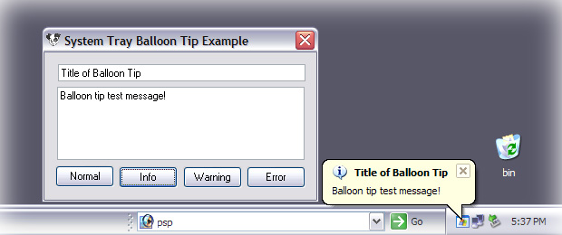



## System Tray Balloon Tip Example \(Bugs Fixed\)

### Description

Shows you how to add an icon to the system tray using a picturebox. It demonstrates how to remove and modify said icon. It also shows you how to display balloon tips on that icon. And, finally, it shows you how to handle user input on the icon and the balloon tip.
 
### More Info
 

             |
---                |---
**Submitted On**   |2004-06-26 17:38:42
**By**             |[Gynecologist](https://github.com/Planet-Source-Code/PSCIndex/blob/master/ByAuthor/gynecologist.md)
**Level**          |Intermediate
**User Rating**    |4.3 (39 globes from 9 users)
**Compatibility**  |VB 5\.0, VB 6\.0
**Category**       |[Windows API Call/ Explanation](https://github.com/Planet-Source-Code/PSCIndex/blob/master/ByCategory/windows-api-call-explanation__1-39.md)
**World**          |[Visual Basic](https://github.com/Planet-Source-Code/PSCIndex/blob/master/ByWorld/visual-basic.md)
**Archive File**   |[System\_Tra1762586262004\.zip](https://github.com/Planet-Source-Code/gynecologist-system-tray-balloon-tip-example-bugs-fixed__1-54577/archive/master.zip)

